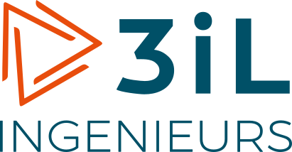
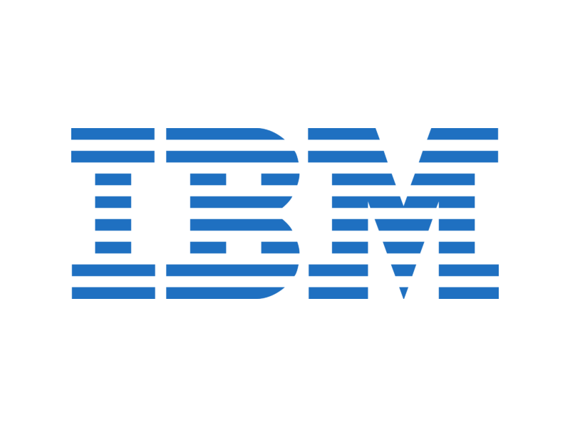
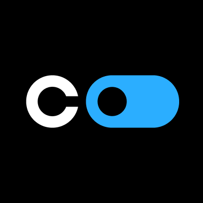
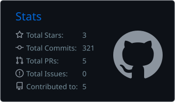
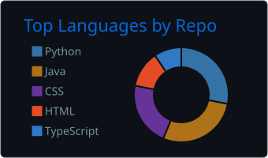

<!-- Profil GitHub : majoiefaya. Images dynamiques fournies par des services tiers. -->

<h1>Lidao Majoie FAYA</h1>
<h3>Élève ingénieur · Logiciel, Data &amp; IA</h3>

Du besoin métier à l’application. Des données à la décision.

<a href="https://github.com/majoiefaya/majoiefaya/raw/refs/heads/main/assets/cv/CV-Lidao-Majoie-FAYA-2026.pdf"><strong>Télécharger mon CV · PDF</strong></a>

  

<strong>Limoges, France</strong> 
À la recherche d'une <strong>alternance dès septembre 2026</strong> en développement logiciel, Data ou IA.

QUALITÉ &nbsp; / &nbsp; COLLABORATION &nbsp; / &nbsp; INNOVATION

 

<a href="#profil">Profil</a> &nbsp; · &nbsp;
<a href="#stack">Technologies</a> &nbsp; · &nbsp;
<a href="#experience">Expériences</a> &nbsp; · &nbsp;
<a href="#projets">Projets</a> &nbsp; · &nbsp;
<a href="#parcours">Parcours</a> &nbsp; · &nbsp;
<a href="#contact">Contact</a>

---

## Profil

Élève ingénieur en informatique à **3iL Ingénieurs**, titulaire d'un **BUT Informatique** et d'une **Licence professionnelle en Génie logiciel**, je possède une expérience concrète en développement full-stack, en traitement de données et en machine learning.

J'aime transformer un besoin métier en une solution complète : **analyse, architecture, développement, sécurisation, tests et déploiement**. Mon objectif est de concevoir des applications logicielles performantes intégrant des solutions **Data et IA** réellement utiles.

- Cycle ingénieur informatique à **3iL Ingénieurs** — 2026 à 2029

- Plus d'un an d'expérience en développement full-stack

- Intérêts : génie logiciel, systèmes distribués, Data Science et intelligence artificielle

- Ambition : évoluer vers la recherche appliquée en IA et les systèmes intelligents

- Français **C2** · Anglais **B2**

<table>
<tr>
<td width="50%" valign="top">
<h3>Ma façon de travailler</h3>

<strong>Engagement, écoute et rigueur.</strong> Comprendre le besoin, échanger avec l’équipe et construire une solution maintenable.

Curiosité et ouverture d’esprit pour apprendre, expérimenter et améliorer les produits au fil des retours utilisateurs.

</td>
<td width="50%" valign="top">
<h3>Ce que je veux construire</h3>

Des applications qui associent <strong>ingénierie logicielle et intelligence des données</strong>, pour les entreprises et les startups.

Approfondir la Data Science, contribuer à des projets concrets et évoluer vers la recherche appliquée en IA.

</td>
</tr>
</table>

### Ce que je peux apporter

| Développement logiciel | Data & Intelligence artificielle | Qualité & mise en production |
|:---:|:---:|:---:|
| Applications web et mobiles | Analyse et préparation des données | Tests automatisés |
| API REST et architectures modulaires | Machine learning et réseaux de neurones | Sécurité applicative |
| Interfaces accessibles et responsives | Modélisation et évaluation prédictive | CI/CD et déploiement |

---

## Technologies & outils

<h3>Langages</h3>

<h3>Back-end & Front-end</h3>

<h3>Data & IA</h3>

<h3>Données, DevOps & qualité</h3>

---

## Expériences professionnelles

### Stage développeur full-stack — IUT Nord Franche-Comté

`Juin 2025 – Août 2025` · Belfort, France

- Conception d’une application d’évaluation des soutenances, rapports et projets pour les enseignants.
- Création d’un générateur de formulaires : sections, critères configurables et notation commune, individuelle ou mixte.
- Développement d’une SPA responsive et accessible avec **Vue.js, Vue Router, Pinia et Vuetify**.
- Implémentation du backend avec **Node.js, Express, MongoDB et Mongoose**.

### Stage développeur front-end — ONDRH

`Février 2025 – Mai 2025` · Paris, France

- Optimisation et ajout de fonctionnalités sur une application web et mobile en **React / React Native**.
- Migration vers une architecture moderne, nettoyage du code legacy et résolution de bugs critiques.
- Réorganisation du code et des dépendances pour améliorer les performances et le temps de chargement.
- Amélioration de l’accessibilité et du dynamisme de l’application.

### CDD développeur full-stack — DDM.A

`Janvier 2024 – Août 2024` · Lomé, Togo

- Implémentation de **COMPTAPROART**, du développement à la mise en production.
- Tests de sécurité logicielle selon les exigences d’audit de **Cyber Defense Africa**.
- Collecte des retours utilisateurs et amélioration continue sur la base des usages terrain.
- Déploiement via un pipeline **CI/CD**, livraisons automatisées et maintenance évolutive.

### Stage développeur full-stack — DDM.A

`Avril 2023 – Septembre 2023` · Lomé, Togo

- Analyse et conception de **COMPTAPROART**, plateforme comptable pour les PME-PMI.
- Planification, étude du marché et analyse des applications concurrentes.
- Création d’API sécurisées avec **Django REST** et définition de l’architecture backend.
- Frontend **Angular** : lazy loading, RxJS, responsive et protection XSS/CSRF/injections SQL.

<strong>Approche projet : de la conception à la production</strong>

Analyse des besoins et des applications existantes, définition de l’architecture, développement des interfaces et API, sécurisation des accès, puis déploiement et maintenance. Les retours utilisateurs nourrissent les évolutions du produit.

**Stack :** Django, Django REST Framework, Angular, MySQL, Bootstrap et JWT.

---

## Projets sélectionnés

<table>
<tr>
<td valign="top">
PROJET À LA UNE · MACHINE LEARNING
<h3>Stabilisation de drone</h3>

Conception d’un modèle de régression pour optimiser la stabilité d’un drone.

<strong>R² = 0,98 · MSE = 0,001</strong>

<code>Régression</code> <code>Modélisation prédictive</code> <code>Évaluation du modèle</code>

<a href="https://www.datascienceportfol.io/majoiefaya">Découvrir mon portfolio Data →</a>
</td>
</tr>
</table>

<table>
<tr>
<td width="50%" valign="top">
APPLICATION MÉTIER
<h3>COMPTAPROART</h3>

Une plateforme de gestion comptable, de l’analyse des besoins à la mise en production.

<code>Django REST</code> <code>Angular</code> <code>MySQL</code>

<a href="https://comptaproart.com/">Découvrir le produit →</a>
</td>
<td width="50%" valign="top">
APPLICATION PÉDAGOGIQUE
<h3>Évaluation des étudiants</h3>

Formulaires configurables et notation des soutenances, rapports et projets pour les enseignants.

<code>Vue.js</code> <code>Express</code> <code>MongoDB</code>

<a href="https://github.com/orgs/Evalmeiutnfc/repositories">Explorer les dépôts →</a>
</td>
</tr>
</table>

### Data Science & machine learning

| Projet | Approche | Résultat principal |
|---|---|---|
| **Prédiction énergétique** | MLP, XGBoost, Random Forest, LightGBM, CatBoost | Estimation de la production d’énergie électrique |
| **Détection d'intrusions réseau** | Classification supervisée | Identification de plusieurs types d'attaques |
| **Test A/B sur les revenus** | Analyse de 5 000 utilisateurs | **+12 %** pour la variante, **p** < 0,01 |

<a href="https://github.com/majoiefaya/Portofolio-Guide"><strong>Guide de mes projets</strong></a>
&nbsp; · &nbsp;
<a href="https://majoiefaya.github.io/Portfolio-Lidao-Majoie-Faya/">Portfolio historique</a>

---

## Formation & certifications

### Formation

<table>
<tr><td align="center" width="110"></td><td><strong>Cycle ingénieur informatique</strong> 3iL Ingénieurs · Limoges, France 1ʳᵉ année · Septembre 2026 – Juin 2029 · Grade de master</td></tr>
<tr><td align="center"></td><td><strong>BUT Informatique — Réalisation d’applications</strong> IUT Nord Franche-Comté · Belfort, France Diplôme obtenu en 2025 · Grade de licence</td></tr>
<tr><td align="center"></td><td><strong>Licence professionnelle Génie logiciel</strong> IPNET Institute of Technology · Lomé, Togo Diplôme obtenu en 2023 · Grade de licence</td></tr>
<tr><td align="center"></td><td><strong>Attestation de réussite de projet professionnel</strong> IPNET Institute of Technology · Lomé, Togo · 2022</td></tr>
</table>

<strong>Les fondations de mon parcours</strong>

- **Baccalauréat scientifique** : les bases de mon parcours scientifique.

- **Licence professionnelle** : analyse, modélisation et développement logiciel.

- **BUT Informatique** : consolidation des compétences en réalisation d’applications, conception, développement et validation.

- **Cycle ingénieur en cours** : poursuite de ma formation en informatique à 3iL Ingénieurs.

### Certifications

<table>
<tr><td width="110" align="center"></td><td><strong>Machine Learning with Python</strong> IBM · Coursera · Janvier – Février 2026</td></tr>
<tr><td align="center"></td><td><strong>Google Advanced Data Analytics Professional Certificate</strong> Google · Coursera · Janvier – Mars 2025</td></tr>
<tr><td align="center"></td><td><strong>AWS Cloud Technical Essentials</strong> AWS · Coursera · Mars 2025</td></tr>
<tr><td align="center"></td><td><strong>Introduction to VueJS Framework</strong> Codio · Coursera · Juin 2025</td></tr>
</table>

<a href="https://coursera.org/share/cdcc4aadee9f2a166c2ff74ca8981f9a">Voir sur Coursera →</a>

---

## Activité GitHub

Les deux cartes ci-dessus sont des instantanés enregistrés le 19 septembre 2026 pour éviter les images cassées. La série de contributions reste dynamique et dépend d’un service externe. Les langages reflètent les dépôts analysés, pas un niveau de maîtrise.

---

## Contact & collaborations

Je suis ouvert aux **opportunités d'alternance**, aux projets open source et aux collaborations autour du développement logiciel, de la Data et de l'intelligence artificielle.

<strong>Une idée, un projet ou une opportunité ? Parlons-en.</strong>

<a href="https://github.com/majoiefaya">GitHub</a> &nbsp; · &nbsp; <a href="https://majoiefaya.github.io/dev-portfolio/">Portfolio développement</a> &nbsp; · &nbsp; <a href="https://www.datascienceportfol.io/majoiefaya">Portfolio Data Science</a>

 
<h3>Soutenir mon travail</h3>

Si mes projets ou mes ressources te sont utiles, tu peux soutenir leur développement.

  

<strong>Merci de ta visite. Au plaisir de construire ensemble.</strong>

